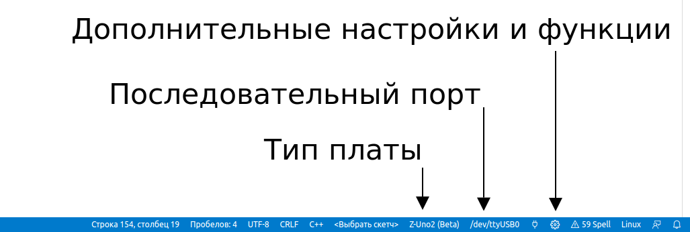
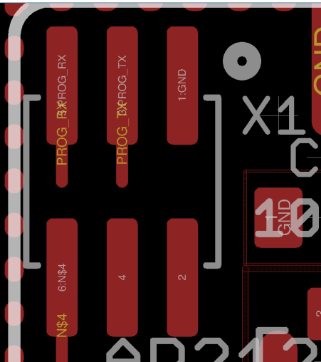
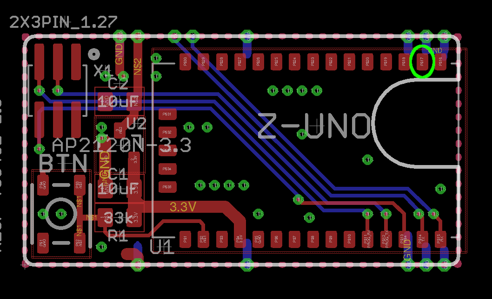
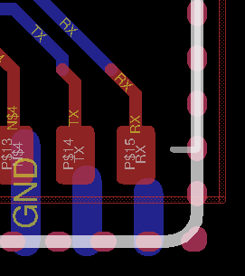
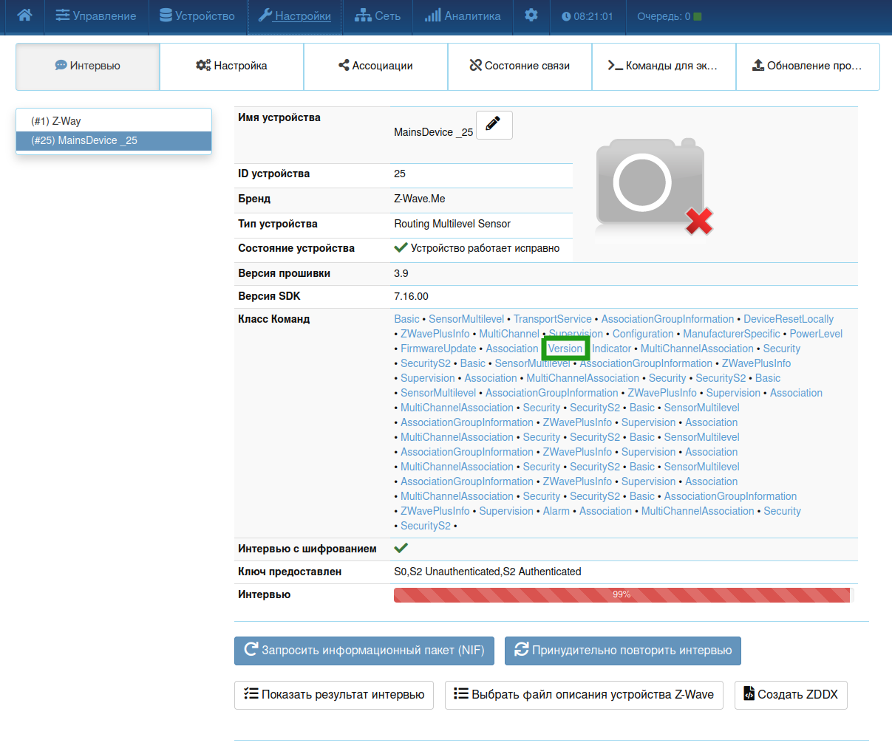

# Сборка и прошивка проекта для модуля ZWAVE-MSW
## Инструментарий
Основным инструментом для сборки и настройки является утилита **zme_make**, доступная в [архиве с инструментами](https://github.com/Z-Wave-Me/Z-Uno-G2-Core/tree/master/toolchain/linux64), а также в каталоге `/Z-Uno2 (Beta)/tools/zme_make` в папке с ZUNO-компонентами при установке расширения ZUNO в VSCode.
Для автоматической сборки проекта потребуется скачать [Z-Uno-G2-Core](https://github.com/Z-Wave-Me/Z-Uno-G2-Core), [GCC](http://rus.z-wave.me/files/z-uno/g2/tc/arm-none-eabi-gcc-7_2_4-linux64.tar.gz) и [Clang](http://rus.z-wave.me/files/z-uno/g2/tc/libclang_11_0_1-linux64.tar.gz).

## Инструкция по сборке
### Настройка сборки в VSCode
Проект для модуля ZUNO выполнен на базе фреймворка Arduino и собственных библиотек Z-Wave. Для ознакомления на сайте ZUNO доступен набор [инструкций](https://z-uno.z-wave.me/getting-started/), в том числе инструкция по [настройке сборки в VS Code](https://z-uno.z-wave.me/vs-code-install/). Текущая версия проекта рассчитана на ZUNO-компоненты версии **Z-Uno2(Beta)(3.0.9)**. 

:warning: **Версия SDK**:иногда при обновлении SDK из его старых версий могут уехать нужные библиотеки. Поэтому, если вы вдруг установили 3.0.9, но нужных библиотек нет, проверьте, не была ли выпущена новая версия.
После установки расширения ZUNO, в статус-баре VSCode появится доступ к дополнительным настройкам и функциям, в которых нужно установить следующие параметры:
1. режим шифрования **S2**
2. частота **RU**
3. мощность радиосигнала **+2.0dBm**
4. опции комплятора: **-Wall;-Werror**

Также в статус-баре можно выбрать тип платы (должен быть Z-Uno2(Beta)) и последовательный порт. Для того, чтобы собрать и прошить проект, нужно открыть основной файл ***.ino** и в верхней панели нажать кнопку **"Загрузить"**.



### Автоматическая сборка
Автоматическая сборка выполняется командой утилиты zme_make
```sh
zme_make build  ${file} \
  -S ${core_path}/Z-Uno-G2-Core/hardware/arduino/zunoG2/cores/ \
  -S ${core_path}/Z-Uno-G2-Core/hardware/arduino/zunoG2/libraries \
  -S ${arm_gcc_path}/lib/gcc/arm-none-eabi/7.2.1/include/ \
  -B ${tmp_path} -T ${arm_gcc_path}/bin/ -lc ${clang_path} \
  -O make_listing -O BO:-DARDUINO=152 \
  -O BO:-DARDUINO_ARCH_ZUNOG2
```
 * `${file}` - .ino файл проекта (скетч, должен быть в проекте один)
 * `${core_path}` - путь к папке с core-файлами
 * `${arm_gcc_path}` -  путь к arm-gcc
 * `${tmp_path}` - временная директория для файлов сборки
 * `${clang_path}` - путь к библиотеке clang

Во временной директории будет создана директория сборки проекта, в которой будет находиться собранный файл .bin.

Также можно собрать используя docker:
```sh
docker build -t zwave-tools .
docker run -v $PWD:/wb-zwave-msw -w /wb-zwave-msw --rm zwave-tools make
```

## Инструкция по прошивке
### Интерфейс 
Прошивка осуществляется через интерфейс UART. 



Левый нижний вывод, обозначенный на схеме как N$4, является входом сигнала RST. Если используемый переходник USB-UART имеет выход DTS, необходимо подключить его на вход RST. Если такой выход отсутствует, то необходимо при каждой операции (в том числе прошивке) коммутировать сигнал RST вручную на GND.

### Предварительная настройка модуля

Перед первой прошивкой модуля необходимо в первую очередь обновить [бутлодер](https://github.com/Z-Wave-Me/Z-Uno-G2-Core/tree/master/hardware/arduino/zunoG2/bootloaders). Рекомендуется выполнять загрузку бутлодера командой: 
```sh
./zme_make boot -c ${bootloader_catalogue_path} -d /dev/ttyUSB0
```

Также возможно загрузить бутлодер, указав конкретный файл:
```
./zme_make boot -f zuno_bootloader_HW0704.bin -d /dev/ttyUSB0
```
Файл **zuno_bootloader_HW0704.bin** соответствует плате модуля (малая ZUNO), остальные файлы соответствуют другим аппаратным платформам. 
Для просмотра информации об устройстве (PIN-кода, настроек мощности, частоты) воспользуйтесь командой 
```
./zme_make boardInfo -d /dev/ttyUSB0 
```
Пример вывода:
```
BOARD INFO
Openning port                            ..............................                            OK
Syncing with Z-Uno                       ..............................                            OK
          ------------------------------------------------------------------------------------
                                        Z-Uno board information
          ------------------------------------------------------------------------------------
          
          FIRMWARE
          
          	 VERSION:		03.09
          	 BUILD_SEQUENCE:	00001839
          	 BUILD_DATETIME:	2022-11-09T14:22:15(MSK)
          	 SUPPORTED_HWREV:	0704
          
          LIMITS
          
          	 CODE:	178176 Bytes
          	 RAM:	16384 Bytes
          
          HARDWARE
          
          	 CHIP_UID:	 84 2E 14 FF FE 6A 2C C8
          	 PROD_TIME:	 2022-02-14T20:12:15(MSK)
          	 PROD_SN:	 115
          	 LOCK:		 DBG_LOCKED
          
          LICENSE
          
          	 SUB_VENDOR:	0115
          	 BITMASK:	000000000000003B
          	 FEATURES:	[PTI KEY_DUMP MODEM MAX_POWER LONG_RANGE]
          	 CRC16:		5ffd
          
          NETWORK
          
          	 HOMEID:	d695231e
          	 NODEID:	17
          
          SECURITY
          
          	S2 DSK:		12029-56086-27556-19986-50975-01644-05326-04495
          	       		_____
          	S2 PIN:		12029
          	QR-Code:	900160175131120295608627556199865097501644053260449500100844903328022000277005280000100777
          ------------------------------------------------------------------------------------
          
          SKETCH
          
          	 NAME:			WbMsw
          	 BUILD_DATETIME:	2022-12-05T17:39:29(MSK)
          	 VERSION:		00.00
          	 SIZE:			27844 Bytes
          	 CRC16:			0cb9
          	 FLAGS:			00000100
          	 CORE_VERSION:		03.09
          	 OTA_FW_ID:		0101
          	 OTA_CUSTOM_FW_COUNT:	00
          	 OTA_PINCODE:		2000c020
          	 OTA_OFFSET:		00000000
          	 DBG_CONSOLE_PIN:	DEFAULT (TX0)
          ------------------------------------------------------------------------------------
          DEVICE CFG
          	Z-Wave Region:RU
          	Security mode:02 Freqi:07 maxTxDb:14 adjTxDb:00 LRTxDb:00 extra_flags:00
DONE
```
Для дальнейшей работы с модулем потребуется запомнить **S2 PIN**, так как он нужен для добавления устройства на сервер. В разделе **DEVICE CFG** можно увидеть текущий режим защиты, частоту, мощность радиосигнала (выводится в hex). 
Если модуль прошивается через расширение VSCode, то дополнительно настраивать модуль не требуется.
Если прошивка осуществляется в автоматическом режиме, то необходимо задать режим шифрования (включено), частоту (7 - RU, 0 - EU) и мощность радиосигнала в dBm *10(последний разряд - десяые доли):
```
./zme_make boardInfo -d /dev/ttyUSB0 -p freq=7 -p main_pow=20 -p sec=2
```
Установка данной мощности радиосигнала рекомендована производителем модуля.

### Загрузка прошивки
Для прошивки из VSCode нужно открыть основной файл ***.ino** и в верхней панели нажать кнопку **"Загрузить"**.
Для прошивки модуля в автоматическом режиме нужно вызвать команду
```
./zme_make bin_upload ./WbMsw.bin -d /dev/ttyUSB0
```

## Инструкция по отладке
Плата модуля имеет отладочный UART интерфейс, по выходу TX которого отправляется вся отладочная информация. Настройки порта: 230400, 8, 1, parity none, flow control none.



Для контроля обмена Modbus-пакетами между MSW и модулем ZUNO есть возможность подпаяться к UART-выходу трансивера шины RS485.



## Проверка версии
При выпуске каждой новой версии необходимо вносить запись в файл changelog, а также вносить версию скетча в файле **WbMsw.ino** в макрос **SKETCH_VERSION**, который находится в глобальном макросе **ZUNO_ENABLE**. Версия скетча задается 16-битным числом, старший байт которого задает мажорную версию, а младший - минорную. Подробная информация о доступных определениях доступна в документации [ZUNO](https://z-uno.z-wave.me/Reference/ZUNO_ENABLE/). 
Узнать текущую версию скетча можно командой получения информации об устройстве утилиты  **zme_make** ( в разделе **SKETCH** ).

Также версию скетча и версию прошивки контроллера MSW можно в экспертном интерфейсе. Для этого необходимо перейти на вкладку **Настройки**. выбрать устройство, открыть класс команд **Version**. 



В разделе **firmware1** приведены мажорная и минорная версия скетча, а в разделе **firmware2** версии прошивки контроллера MSW.

## Обновление прошивки
Для обновления скетча и прошивки контроллера MSW через интерфейс ZWAVE необходимо перейти в экспертный интерфейс, в разделе **Настройки** выбрать нужное устройство, перейти на вкладку **Обновление прошивки**.

Для обновления скетча в выпадающем списке выбрать **1: Дополнительный чип 1**, для обновления контроллера MSW - **1: Дополнительный чип 2**. Далее необходимо выбрать файл прошивки (для прошивки MSW нужно изменить расширение файла на ***.bin***), затем нажать кнопку **Обновить**. Дождаться завершения операции
